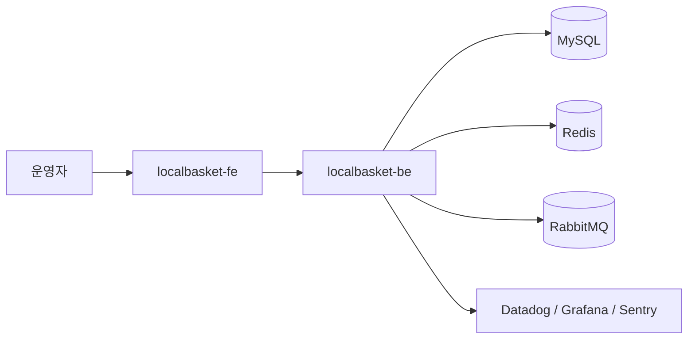

# LocalBasket Workspace

[](https://github.com/localbasket-labs/localbasket-workspace/actions/workflows/ci.yml)

근거리 주문, 재고, 배차 리스크를 한 화면에서 다루는 운영형 커머스 워크스페이스입니다.

## 해결하는 문제

근거리 커머스는 약속 시간이 짧고 재고 변동이 빨라서 주문 승인, 재고 확인, 배차 판단이 분리되면 장애가 바로 고객 경험으로 이어집니다. LocalBasket은 주문 신호를 리스크 점수로 바꾸고, 위험 주문만 재고 검수 흐름으로 보내는 운영 시스템입니다.

## 레포 구조

| 구분 | 레포 | 설명 |
| --- | --- | --- |
| Workspace | [`localbasket-workspace`](https://github.com/cyjoon68/localbasket-workspace) | Git submodule 루트 |
| Frontend | [`localbasket-fe`](https://github.com/localbasket-labs/localbasket-fe) | Expo 기반 운영 대시보드 |
| Backend | [`localbasket-be`](https://github.com/localbasket-labs/localbasket-be) | Kotlin/Spring 주문 판단 API |

## 주요 기능

- 짧은 약속 시간, 많은 상품 수량을 기준으로 주문 리스크 판단
- 위험 주문은 재고 검수 흐름으로 분기
- FE/BE 분리, workspace에서 submodule로 관리

## 아키텍처



## 기술 스택

- Frontend: Expo Router, React Native, `ky`, `react-native-unistyles`
- Backend: Kotlin, Spring Boot, REST
- Infra baseline: MySQL, Redis, RabbitMQ, GitHub Actions, ArgoCD
- Observability: Datadog, Grafana, Sentry

## 실행

```bash
git submodule update --init --recursive
cd localbasket-be && gradle test
cd ../localbasket-fe && npm install && npm test
```

## 운영 기준

- 기본 브랜치: `develop`
- 배포 기준: CI 통과 후 ArgoCD 동기화
- 관측 기준: API latency, manual review rate, dispatch ETA

## 다음 개선

- 매장별 재고 정책 분리
- 라이더 가용성 기반 배차 점수 보정
- 실시간 품절 이벤트 스트림 처리
